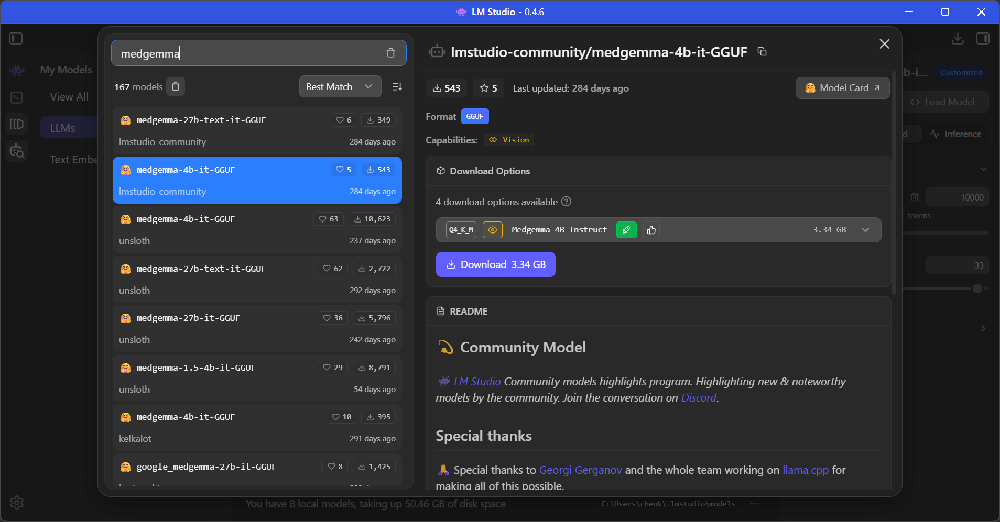
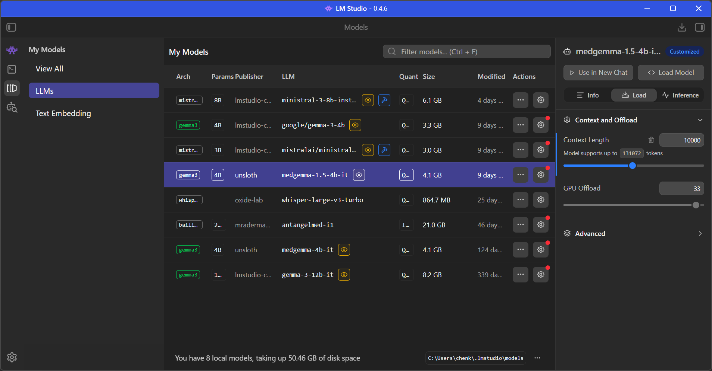
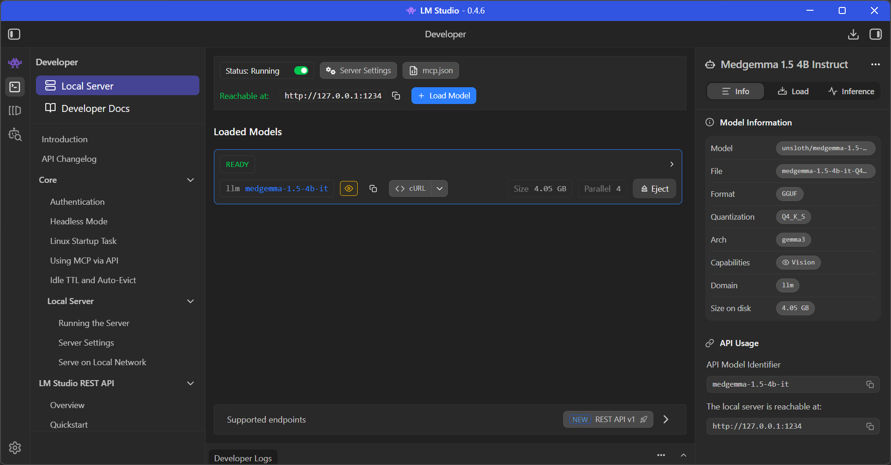

# Medical Transcription — User Manual

## Table of Contents

1. [Overview](#overview)
2. [Prerequisites](#prerequisites)
3. [Installation & Setup](#installation--setup)
   - [Python Virtual Environment](#python-virtual-environment)
   - [OpenAI API Key](#openai-api-key)
   - [LM Studio Local Server Setup](#lm-studio-local-server-setup-optional)
   - [Database & Static Files](#database--static-files)
4. [Starting the Server](#starting-the-server)
5. [Navigating the Application](#navigating-the-application)
6. [Recording & Transcribing Audio](#recording--transcribing-audio)
   - [Record a New File](#record-a-new-file)
   - [Upload an Existing File](#upload-an-existing-file)
7. [Working with Transcription Results](#working-with-transcription-results)
   - [Viewing Results](#viewing-results)
   - [Editing the Transcript](#editing-the-transcript)
   - [SOAP Note Output](#soap-note-output)
   - [Editing the SOAP Note Directly](#editing-the-soap-note-directly)
   - [Editing the SOAP Note with LLM Instructions](#editing-the-soap-note-with-llm-instructions)
   - [Using Voice Instructions](#using-voice-instructions)
   - [Regenerating the SOAP Note](#regenerating-the-soap-note)
8. [Managing Transcriptions](#managing-transcriptions)
   - [Transcription List](#transcription-list)
   - [Deleting Transcriptions](#deleting-transcriptions)
9. [Project Structure Reference](#project-structure-reference)
10. [Troubleshooting](#troubleshooting)

---

## Overview

The **Medical Transcription** application is a locally hosted web application that helps medical professionals convert doctor-patient audio conversations into structured clinical notes. It provides:

- **In-browser audio recording** — record directly from your microphone.
- **Audio file upload** — upload pre-recorded MP3, WAV, or WebM files.
- **AI-powered transcription** — audio is transcribed using the OpenAI `gpt-4o-mini-transcribe` model or locally with the Whisper `large-v3-turbo` model.
- **Automatic SOAP note generation** — transcripts are automatically formatted into Subjective, Objective, Assessment, and Plan (SOAP) notes using OpenAI's `gpt-4o-mini` or a compatible local language model (e.g., MedGemma).
- **Rich text editing** — directly edit the generated SOAP note in a rich text editor (CKEditor).
- **LLM-assisted editing** — provide natural-language instructions (typed or spoken) to modify the SOAP note via AI.
- **Result management** — browse, review, and delete past transcriptions.

---

## Prerequisites

| Requirement | Details |
|---|---|
| **Python** | Version 3.12 or earlier (pydub requires standard library modules removed in 3.13). |
| **pip** | Comes with Python; used to install dependencies. |
| **OpenAI API Key** | A valid API key from [OpenAI](https://platform.openai.com/). Required if not using local AI models for transcription and SOAP note generation. |
| **Web Browser** | A modern browser (Chrome, Edge, Firefox) with microphone access for recording. |
| **FFmpeg** (recommended) | Required by `pydub` for audio processing. Install via your package manager or [ffmpeg.org](https://ffmpeg.org/). |

---

## Installation & Setup

### Python Virtual Environment

1. Open a terminal and navigate to the repository root directory.
2. Create a virtual environment:

   **Linux:**
   ```bash
   python3.12 -m venv .py3_12_venv
   ```

   **Windows:**
   ```powershell
   py -3.12 -m venv .py3_12_venv
   ```

3. Activate the virtual environment:

   **Linux:**
   ```bash
   . .py3_12_venv/bin/activate
   ```

   **Windows PowerShell:**
   ```powershell
   .\.py3_12_venv\Scripts\activate
   ```

4. Install dependencies:
   ```bash
   pip install -r transcriber/requirements.txt
   ```

   This installs:
   - **Django 5.2** — web framework
   - **django-ckeditor** — rich text editor widget
   - **faster-whisper** — local audio transcription
   - **openai** — OpenAI API client
   - **pydantic** — structured output parsing for SOAP notes
   - **pydub** — audio file splitting and silence detection
   - **waitress** — production-grade WSGI server
   - **whitenoise** — static file serving

> **Tip:** Deactivate the virtual environment at any time with the `deactivate` command.

---

### OpenAI API Key & Local Model Config

1. Navigate to the Django project root:
   ```
   transcriber/be/django_project/
   ```
2. Create a file named `.env` in this directory.
3. Add your API key and local model configuration in JSON format:
   ```json
   {
       "openai_api_key": "your_key_here",
       "local_llm_api_config": {
           "port": 1234,
           "models": ["your_local_model_here"]
       }
   }
   ```

> **Important:** Keep this file secure and do not commit it to version control. The `.gitignore` should already exclude it.

---

### LM Studio Local Server Setup (Optional)

To use a local language model for SOAP note generation (e.g., MedGemma) instead of or alongside the OpenAI API, you can run a model locally through [LM Studio](https://lmstudio.ai/).

#### 1. Download a Model

1. Open LM Studio and navigate to the **Model Search** tab (magnifying glass icon on the left sidebar).
2. Search for a medical language model such as `medgemma`.
3. Select an appropriate model variant (e.g., **medgemma-4b-it-GGUF** from lmstudio-community) and click **Download**.



#### 2. Adjust Context Max Tokens

1. In the **My Models** tab, select the downloaded model.
2. On the right-hand panel, locate the **Context and Offload** section.
3. Increase the **Context Length** value. The default may be too short for medical transcription SOAP note generation — a value of **10000** tokens or more is suggested, depending on the length of your audio transcripts.



#### 3. Start the Server and Load Models

1. Navigate to the **Developer** tab (code icon on the left sidebar).
2. Toggle the **Status** switch to **Running** to start the local server.
3. Note the **Reachable at** URL (default: `http://127.0.0.1:1234`).
4. Click **+ Load Model** and select your downloaded model. It will appear under **Loaded Models** with a **READY** status once loaded.
5. Ensure the `port` and `models` values in the `local_llm_api_config` section of your `.env` file match the LM Studio server settings.



---

### Database & Static Files

From the `transcriber/be/django_project/` directory, with your virtual environment activated:

1. **Apply database migrations** (creates the SQLite database and tables):
   ```bash
   python manage.py migrate
   ```

2. **Collect static files** (gathers CSS, JS, fonts into `staticfiles/` for serving):
   ```bash
   python manage.py collectstatic
   ```

---

## Starting the Server

### Option A: Using the Shell Script (Linux)

From `transcriber/be/django_project/`:

```bash
./init_server.sh
```

This script runs migrations, collects static files, and starts the server in one step.

### Option B: Manual Start

From `transcriber/be/django_project/`:

```bash
waitress-serve --host=127.0.0.1 --port=8000 django_project.wsgi:application
```

Once running, open your browser and navigate to:

```
http://127.0.0.1:8000/transcriber/
```

You can also use `localhost` instead of `127.0.0.1` (e.g., `http://localhost:8000/transcriber/`).

---

## Navigating the Application

The application has a dark navigation bar at the top with two main buttons:

| Button | Destination | Description |
|---|---|---|
| **Record and Transcribe** | Home page (`/transcriber/`) | Record new audio or upload files for transcription. |
| **Transcriptions** | Results list (`/transcriber/results`) | View and manage all past transcription records. |

---

## Recording & Transcribing Audio

The home page is divided into two sections side-by-side:

### Record a New File

1. Select your preferred transcription and summarization language models using the dropdown menus.
2. Click the **Start Recording** button. Your browser will ask for microphone permission — allow it.
3. A timer displays the recording duration.
3. Click **Stop Recording** when finished.
4. After stopping:
   - An **audio player** appears so you can preview the recording.
   - A **Download MP3** link lets you save the file locally.
   - The recording is **automatically sent** to the server for transcription.
5. A loading modal displays: *"Please wait for transcription to complete..."*
6. Once complete, the **Transcription Results** section appears below with:
   - The raw transcript on the left.
   - The SOAP-formatted note on the right.

### Upload an Existing File

1. Select your preferred transcription and summarization language models using the dropdown menus.
2. Use the **Choose File** button on the right side to select an audio file.
   - **Supported formats:** MP3, WAV, WebM.
3. Click **Submit**.
3. A loading modal appears while the file is transcribed.
4. The transcription results display on the same page after processing.

> **Note:** Large audio files are automatically split into chunks at silence points before transcription. Each chunk is transcribed individually and the results are combined.

---

## Working with Transcription Results

After transcription completes — either from the home page or by opening a saved result — you see a split-panel layout.

### Viewing Results

- **Left panel:** The raw transcript text in an editable text area.
- **Right panel:** The generated SOAP note in a rich text editor.
- **Audio player:** (On saved result pages) plays back the original recording.

### Editing the Transcript

The transcript text area is editable. You can:

1. Modify the transcript text directly in the text area.
2. Click **Regenerate from transcript** to create a new SOAP note from the updated text.

If you edit the transcript and regenerate, the application saves your edits as a separate "edited transcript" alongside the original. Future regenerations will use your edited version.

### SOAP Note Output

The SOAP note is structured into four sections using professional medical terminology:

| Section | Content |
|---|---|
| **Subjective** | Patient-reported symptoms, history, and complaints. |
| **Objective** | Clinical observations, examination findings, and measurements. |
| **Assessment** | Diagnosis or clinical impression based on findings. |
| **Plan** | Treatment plan, follow-up actions, and recommendations. |

The note is formatted in HTML and displayed in a rich text editor (CKEditor). If the transcript is in a non-English language, the SOAP note is automatically translated to English.

### Editing the SOAP Note Directly

1. Click inside the rich text editor on the right panel.
2. Make your changes using the CKEditor toolbar (bold, italic, lists, etc.).
3. Click the **Save** button below the editor to persist your changes.

### Editing the SOAP Note with LLM Instructions

Below the SOAP editor, there is an **"Instruct Changes with Language Model"** section:

1. Type a natural-language instruction in the text box (max 500 characters).
   - Example: *"Add a follow-up appointment in 2 weeks to the plan section."*
2. Click the **Send** button.
3. A loading spinner appears over the editor while the AI processes your instruction.
4. The SOAP note updates automatically with the requested changes.

### Using Voice Instructions

Instead of typing instructions, you can speak them:

1. Click the **Voice** button (microphone icon).
2. Speak your instruction clearly.
3. Click the **Stop** button to finish recording.
4. Your speech is transcribed and appended to the instruction text box.
5. Click **Send** to apply the instruction to the SOAP note.

> **Tip:** You can combine typed and voice input — the voice transcript is appended to any existing text in the instruction box.

### Regenerating the SOAP Note

Click **Regenerate from transcript** to discard the current SOAP note and generate a fresh one from the transcript. This is useful after making significant transcript edits.

---

## Managing Transcriptions

### Transcription List

Navigate to **Transcriptions** in the navigation bar to view all saved transcriptions.

The list displays:

| Column | Description |
|---|---|
| **Filename** | Clickable link that opens the full transcription result page. |
| **Created/Added** | Timestamp of when the transcription was created (converted to local time). |
| **Checkbox** | Select transcriptions for batch deletion. |

Results are paginated at 30 items per page. Use the page navigation controls to browse through older records.

### Deleting Transcriptions

**Single or batch deletion:**

1. Check the boxes next to the transcription(s) you want to delete.
2. Click the **Delete** button in the table header.
3. A confirmation modal appears:
   - If items are selected: confirms deletion and warns that audio files will be permanently removed.
   - If no items are selected: a warning message appears instead.
4. Click **Confirm** to proceed with deletion.

> **Caution:** Deleting a transcription permanently removes both the database record and the stored audio file. Make a copy of the audio file before deleting if you still need it.

---

## Project Structure Reference

```
transcriber/
├── requirements.txt                  # Python package dependencies
└── be/
    └── django_project/
        ├── manage.py                 # Django management CLI
        ├── init_server.sh            # One-step setup + start script (Linux)
        ├── .env                      # OpenAI API key (user-created, not tracked)
        ├── db.sqlite3                # SQLite database (auto-generated)
        ├── django_project/           # Django project configuration
        │   ├── settings.py           # App settings, API key loading, middleware
        │   ├── urls.py               # Root URL routing
        │   ├── wsgi.py               # WSGI entry point (used by waitress)
        │   └── asgi.py               # ASGI entry point
        └── transcriber/              # Main Django application
            ├── models.py             # Transcription data model
            ├── views.py              # View handlers for all pages and API endpoints
            ├── urls.py               # App-level URL routing
            ├── forms.py              # Form definitions (upload, edit, text input)
            ├── admin.py              # Django admin configuration
            ├── gpt_transcription.py  # OpenAI API integration, audio chunking, SOAP generation
            ├── templates/transcriber/ # HTML templates
            │   ├── base.html         # Base layout with navbar and footer
            │   ├── _navbar.html      # Navigation bar partial
            │   ├── recorder.html     # Home page (record/upload + results)
            │   ├── result.html       # Individual transcription result page
            │   ├── result_list.html  # Paginated list of all transcriptions
            │   └── pagination_base.html # Pagination controls template
            ├── static/transcriber/   # CSS and JS assets
            │   ├── main.css          # Application styles
            │   ├── modal.css         # Modal dialog styles
            │   ├── modal.js          # Modal open/close logic
            │   ├── recorder.js       # Audio recording utilities
            │   ├── material_symbols.css # Icon font styles
            │   └── time_convert.js   # Timestamp localization
            └── media/audio/          # Stored audio files (auto-created)
```

---

## Troubleshooting

| Issue | Solution |
|---|---|
| **Server won't start** | Ensure your virtual environment is activated and dependencies are installed. Verify you are in the `transcriber/be/django_project/` directory. |
| **"No module named pydub"** or similar | Run `pip install -r transcriber/requirements.txt` with the virtual environment active. |
| **Audio processing fails** | Ensure FFmpeg is installed and available in your system PATH. pydub requires it for MP3/WAV processing. |
| **Transcription returns errors** | Check that your `.env` file exists in `transcriber/be/django_project/` with a valid `openai_api_key`. Verify API key has access to the `gpt-4o-mini-transcribe` and `gpt-4o-mini` models. |
| **Microphone not working** | Grant microphone permission in your browser when prompted. Ensure no other application is using the microphone. Use HTTPS or `localhost` — browsers block microphone access on non-secure origins. |
| **Static files not loading (404)** | Run `python manage.py collectstatic` before starting the server. |
| **Database errors after code changes** | Run `python manage.py migrate` to apply any new migrations. |
| **Python 3.13+ compatibility** | Use Python 3.12 or earlier. pydub relies on standard library modules (`audioop`) that were removed in Python 3.13. |
| **Page shows "Transcription not found"** | The transcription may have been deleted. Return to the Transcriptions list to verify. |
